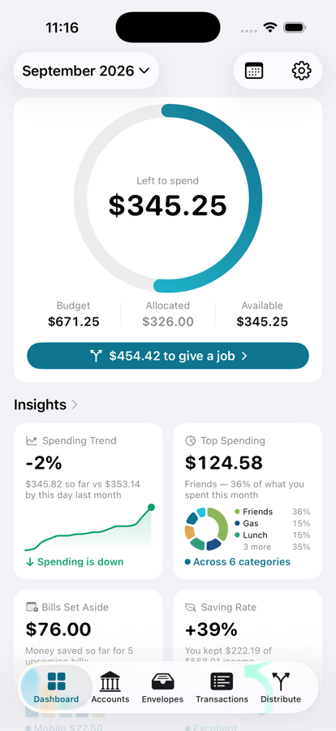
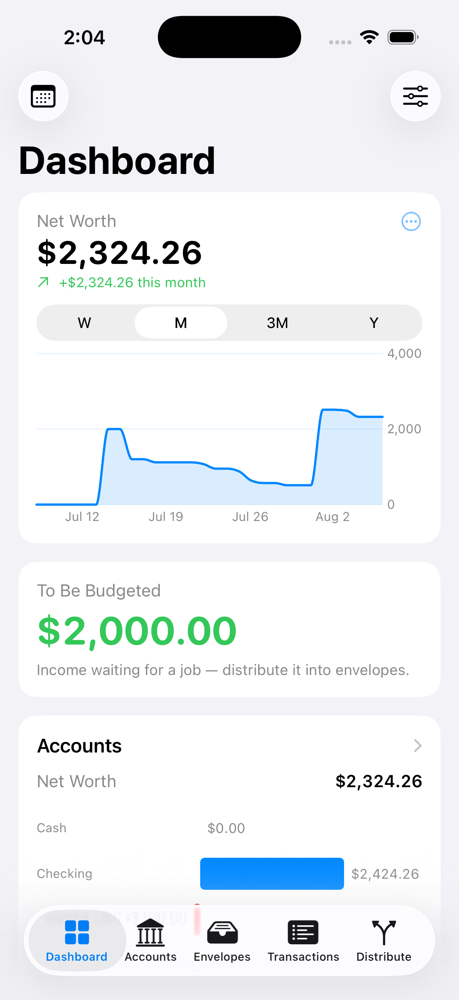
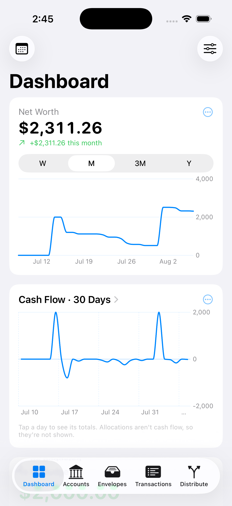

# Liquid

A private, on-device personal budgeting app for iOS, built with SwiftUI and
SwiftData. Liquid uses **envelope (zero-based) budgeting**: money is tracked two
ways at once — *where it is* (an account) and *what it is for* (an envelope) — and
every dollar of income is given a job.

Everything runs on the device. No account, no network calls, no third-party
services — private by construction.

<p>
  
  
  
</p>

## Features

- **Accounts, grouped by bank** — checking, savings, cash, and **credit cards**
  (with a credit limit, amount owed, available credit, and utilization). Net worth
  splits into assets vs. liabilities.
- **Transfers** — move money between accounts, including a one-tap **Pay Balance**
  for credit cards.
- **Envelopes** — budget categories with balances, optional savings targets, and an
  **allocation rule** each (fixed amount, percentage of paycheck, fill-to-target, or
  remainder). Tap through to a full history.
- **Transactions** — record income and expenses (and transfers), edit or delete
  them, and filter by date range and envelope.
- **Distribute Paycheck** — the signature flow: sweep unbudgeted income into
  envelopes by their rules, review and adjust the split, then confirm.
- **Dashboard** — a customizable set of cards: **To Be Budgeted**, accounts,
  envelopes, cash flow, spending by category, and a net-worth trend. **Drag to
  reorder** cards and **choose each card's chart type** (e.g. bars vs. donut).
- **Spending Calendar** — a month view of daily net cash flow; tap a day for its
  income, spending, and transactions.

## How it works

Money has two independent properties at the same time:

- **Where it is** — its **account**. An account balance is income in minus expenses
  out (a credit card's negative balance is what you owe).
- **What it is for** — its **envelope**. An envelope balance is allocations in minus
  expenses out.

**To Be Budgeted** is income that has arrived but hasn't been given a job yet
(`income − allocations`). The goal of zero-based budgeting is to drive it to zero —
"every dollar has a job" — which is exactly what the Distribute Paycheck flow does.
Allocations assign existing dollars a job **without moving them**, so distributing a
paycheck changes envelope balances but never account balances or net worth.

## Architecture

Layered MVVM + repository, so the UI depends on the domain layer rather than on
storage:

- **Models** (`Liquid/Models/`) — SwiftData `@Model` types: `Institution`,
  `Account`, `Envelope`, `Transaction`, `AllocationRule`.
- **Domain** (`Liquid/Domain/`) — `DistributionEngine` (the pure, unit-tested
  paycheck algorithm), `BudgetMath` (balances, net worth, To Be Budgeted,
  credit-card and time-series helpers), and `BudgetRepository` (the seam between the
  UI and SwiftData).
- **Views** (`Liquid/Views/`) — SwiftUI screens, grouped by feature, plus Swift
  Charts for the dashboard.

Amounts are always stored positive; the sign is derived from the transaction type at
calculation time. See [`Documentation/`](Documentation/) for the full write-up —
data model, the distribution algorithm, screens, and testing.

## Getting started

Requirements: **Xcode 26** and an **iOS 26** simulator (or device).

```bash
git clone git@github.com:Jack20410/Liquid.git
cd Liquid
open Liquid.xcodeproj
```

Then build and run from Xcode (⌘R). In **debug** builds the app seeds sample data on
first launch (two banks, a credit card, and a month of transactions) so it's
explorable immediately; **release** builds start empty with your own data.

From the command line:

```bash
xcodebuild -project Liquid.xcodeproj -scheme Liquid \
  -destination 'platform=iOS Simulator,name=iPhone 17 Pro' build
```

## Testing

The domain layer is covered by unit tests (Swift Testing) — the distribution engine
(including the spec's worked example), balance and net-worth math, credit-card and
transfer invariants, and the calendar/day summaries.

```bash
xcodebuild -project Liquid.xcodeproj -scheme Liquid \
  -destination 'platform=iOS Simulator,name=iPhone 17 Pro' \
  test -only-testing:LiquidTests
```

## Project structure

```
Liquid/
  Models/        SwiftData models
  Domain/        DistributionEngine, BudgetMath, BudgetRepository
  Views/         Dashboard, Accounts, Envelopes, Transactions,
                 Distribute, Calendar, Settings, Shared
  Support/       DEBUG-only sample data
LiquidTests/     Unit tests
Documentation/   Overview, architecture, data model, screens, testing
```

## Status

The full v1 feature set is implemented. Out of scope for v1 (by design): automatic
bank/card import, multi-device sync, cloud backup, and multi-currency.

## Contributing

Development uses a lean `main` / `develop` git flow with PR-based, CI-gated merges — see
[CONTRIBUTING.md](CONTRIBUTING.md).

## License

Released under the MIT License — see [LICENSE](LICENSE).
