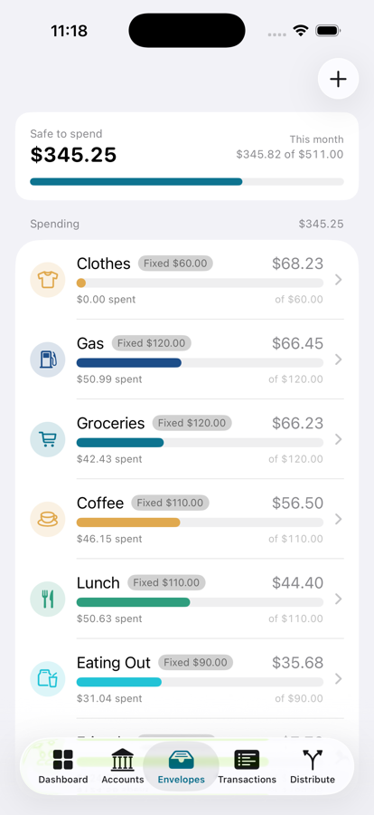
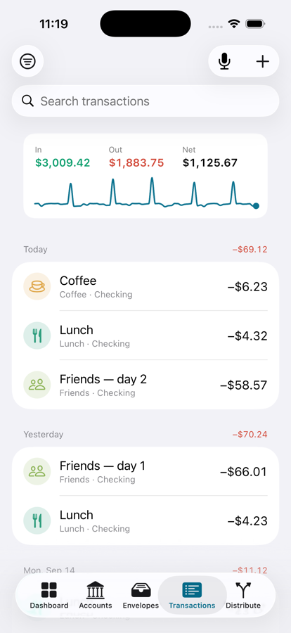
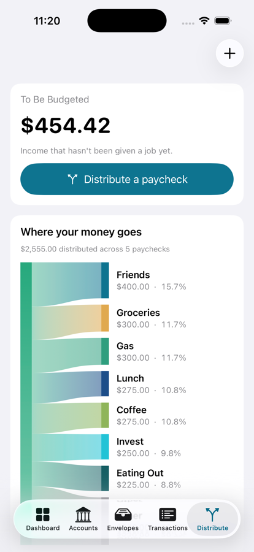
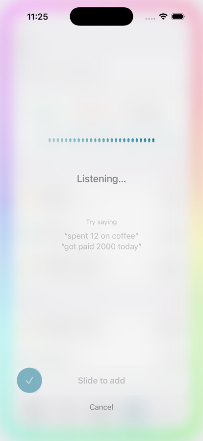
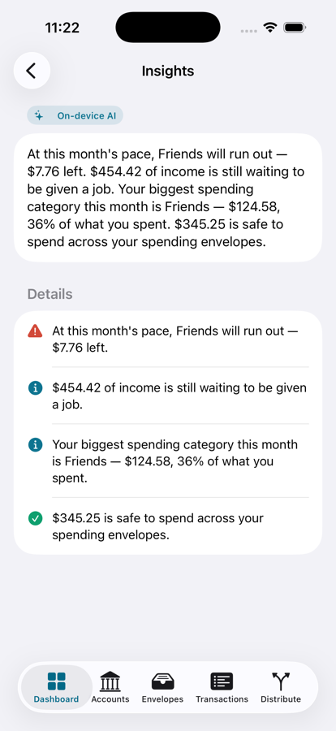

# Liquid

A private, on-device personal budgeting app for iOS, built with SwiftUI and
SwiftData. Liquid uses **envelope (zero-based) budgeting**: money is tracked two
ways at once — *where it is* (an account) and *what it is for* (an envelope) — and
every dollar of income is given a job.

Everything runs on the device. No account, no network calls, no third-party
services — private by construction.

**[▶ Try the live demo](https://appetize.io/app/b_xqlx7tfpv2jl5p4i44f4ac4z64)** — runs
in the browser, no install needed.

<table>
  <tr>
    <td width="33%" align="center">
      <br />
      <sub><b>Dashboard</b><br />A budget ring showing what's left to spend, a month
      picker, and four insight tiles that each say what their number is measured against.</sub>
    </td>
    <td width="33%" align="center">
      <br />
      <sub><b>Envelopes</b><br />Categories grouped into Spending, Bills and Goals —
      each with its own icon and color, and a spend-vs-budget bar for the month.</sub>
    </td>
    <td width="33%" align="center">
      <br />
      <sub><b>Transactions</b><br />Grouped by day with per-day totals, search, filters,
      and an In / Out / Net summary above the list.</sub>
    </td>
  </tr>
  <tr>
    <td width="33%" align="center">
      <br />
      <sub><b>Distribute</b><br />The signature flow: a paycheck swept into envelopes by
      their rules, with a "where your money goes" diagram of the split.</sub>
    </td>
    <td width="33%" align="center">
      <br />
      <sub><b>Say it</b><br />Speak a transaction. On-device speech becomes a draft you
      confirm with a slide — the language model never touches the numbers.</sub>
    </td>
    <td width="33%" align="center">
      <br />
      <sub><b>Insights</b><br />A plain-language read on your month, rephrased by Apple's
      on-device model from figures the app computed itself.</sub>
    </td>
  </tr>
</table>

## Features

- **Accounts, grouped by bank** — checking, savings, cash, and **credit cards**
  (with a credit limit, amount owed, available credit, and utilization). Net worth
  splits into assets vs. liabilities.
- **Transfers** — move money between accounts, including a one-tap **Pay Balance**
  for credit cards.
- **Envelopes** — budget categories with balances, optional savings targets, and an
  **allocation rule** each (fixed amount, percentage of paycheck, fill-to-target, or
  remainder). Tap through to a full history.
- **Transactions** — record income and expenses (and transfers), edit or delete
  them, and filter by date range and envelope.
- **Distribute Paycheck** — the signature flow: sweep unbudgeted income into
  envelopes by their rules, review and adjust the split, then confirm. A
  **"where your money goes"** flow diagram and a log of past distributions show
  where each paycheck landed.
- **Safe to Spend** — what's left across your day-to-day *spending* envelopes,
  once bills and savings goals are set aside.
- **Dashboard** — a customizable set of cards led by the **budget ring** (what's left
  to spend, against what's budgeted and allocated), a 2×2 grid of **insight tiles**
  (spending trend, top category, bills set aside, saving rate) scoped by a month
  picker, recent transactions, accounts, envelopes, cash flow, spending by category,
  and a net-worth trend. **Drag to reorder** cards, and switch the cash-flow and
  spending charts between chart types.
- **Say it** — speak a transaction ("spent 12 on coffee") and it becomes a pre-filled
  draft you confirm with a slide. Speech is transcribed on-device and Apple's
  Foundation Models turn the words into fields; the app parses every amount itself, so
  the model never invents a number.
- **AI Insights** — a short, plain-language read on your month. The figures come from
  the app's own math and the on-device model only rephrases them, with a guardrail
  that rejects any narration whose numbers drifted from the source.
- **Icons & colors** — every envelope carries its own SF Symbol and palette color,
  suggested from the category name and editable, and they follow it everywhere:
  rows, transactions, and the dashboard charts.
- **Onboarding** — a first-run walkthrough that creates real accounts and envelopes
  as you go, rather than showing slides you have to redo afterwards.
- **Spending Calendar** — a month view of daily net cash flow; tap a day for its
  income, spending, and transactions.
- **Light & dark** — a cohesive, water-inspired theme throughout.

## How it works

Money has two independent properties at the same time:

- **Where it is** — its **account**. An account balance is income in minus expenses
  out (a credit card's negative balance is what you owe).
- **What it is for** — its **envelope**. An envelope balance is allocations in minus
  expenses out.

**To Be Budgeted** is income that has arrived but hasn't been given a job yet
(`income − allocations`). The goal of zero-based budgeting is to drive it to zero —
"every dollar has a job" — which is exactly what the Distribute Paycheck flow does.
Allocations assign existing dollars a job **without moving them**, so distributing a
paycheck changes envelope balances but never account balances or net worth.

## Architecture

Layered MVVM + repository, so the UI depends on the domain layer rather than on
storage:

- **Models** (`Liquid/Models/`) — SwiftData `@Model` types: `Institution`,
  `Account`, `Envelope`, `Transaction`, `AllocationRule`.
- **Domain** (`Liquid/Domain/`) — `DistributionEngine` (the pure, unit-tested
  paycheck algorithm), `BudgetMath` (balances, net worth, To Be Budgeted,
  credit-card and time-series helpers), and `BudgetRepository` (the seam between the
  UI and SwiftData).
- **Views** (`Liquid/Views/`) — SwiftUI screens, grouped by feature, plus Swift
  Charts for the dashboard.

Amounts are always stored positive; the sign is derived from the transaction type at
calculation time. The domain layer is covered by unit tests (Swift Testing) and every
PR is CI-gated. See [`Documentation/`](Documentation/) for the full write-up — data
model, the distribution algorithm, screens, and testing.

## Getting started

Requirements: **Xcode 26** and an **iOS 26** simulator (or device).

```bash
git clone git@github.com:Jack20410/Liquid.git
cd Liquid
open Liquid.xcodeproj
```

Then build and run from Xcode (⌘R). In **debug** builds the app seeds sample data on
first launch (two banks, a credit card, and a month of transactions) so it's
explorable immediately; **release** builds start empty with your own data.

From the command line:

```bash
xcodebuild -project Liquid.xcodeproj -scheme Liquid \
  -destination 'platform=iOS Simulator,name=iPhone 17 Pro' build
```

## Live demo

Try Liquid in the browser — no install, no Xcode:

**[appetize.io/app/b_xqlx7tfpv2jl5p4i44f4ac4z64](https://appetize.io/app/b_xqlx7tfpv2jl5p4i44f4ac4z64)**

It runs a debug build, so it starts at the onboarding walkthrough (tap **Skip** to jump
straight in) and comes seeded with a few months of sample spending.

Two caveats, because the demo runs on a cloud simulator rather than a real iPhone:

- **"Say it" is hidden** — voice capture needs Apple Intelligence and a microphone,
  neither of which a cloud simulator has.
- **Insights show their deterministic sentences** rather than the on-device AI
  narration, for the same reason. The figures are identical either way; on a supported
  device the model rephrases them and the card is badged *On-device AI*.

Both features are real — the screenshots above were taken on a simulator with Apple
Intelligence available.

## Project structure

```
Liquid/
  Models/        SwiftData models
  Domain/        DistributionEngine, BudgetMath, BudgetRepository
  Views/         Dashboard, Accounts, Envelopes, Transactions,
                 Distribute, Calendar, Settings, Shared
  Support/       DEBUG-only sample data
LiquidTests/     Unit tests
Documentation/   Overview, architecture, data model, screens, testing
```

## Status

The full v1 feature set is implemented. Out of scope for v1 (by design): automatic
bank/card import, multi-device sync, cloud backup, and multi-currency.

## Contributing

Development uses a lean `main` / `develop` git flow with PR-based, CI-gated merges — see
[CONTRIBUTING.md](CONTRIBUTING.md).

## License

Released under the MIT License — see [LICENSE](LICENSE).
